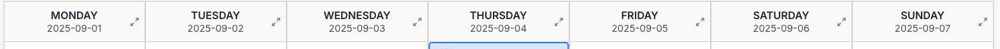

# TODO: Change Date Format to dd/mm/yyyy in Schedule

## Steps:
- [ ] Add helper function `formatDateToDDMMYYYY` in `components/dashboard/tabs/schedule/schedule/utils.ts`
- [ ] Update `formatDateRange` function in `utils.ts` to use the new helper
- [ ] Update day view date formatting in `components/dashboard/tabs/schedule/ClassScheduleView.tsx` to use dd/mm/yyyy
- [ ] Test the changes in the application
